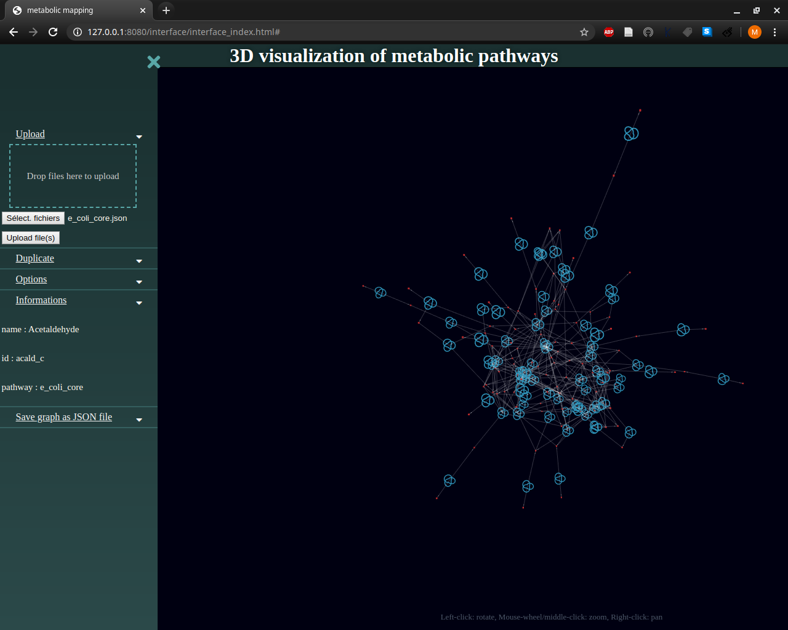

# Metabolic Mapping

Web application to visualise in 3D metabolic pathway.  

  

## Install

### Repository import

`git clone https://gitlab.gencovery.com/dev/internships/2020/m1-ubordeaux/testclass.git`

### Node server installation & set up

Node installation :  
`sudo apt install npm`  
Server installation, with the `http-server` package :  
`sudo npm install -g http-server`  

## Usage

To run the web application, browser use is required. Only Chrome and Firefox browser are guaranteed. Local node server is required (See below).

```
cd testclass/
http-server
```

Open the first link to open the browser (`http://127.0.0.1:8080`).

## Autors  

Students of the Bioinformatics Master of the University of Bordeaux.  

> Marine ALVES DE BARROS - [marine.alves-de-barros@etu.u-bordeaux.fr](mailto:marine.alves-de-barros@etu.u-bordeaux.fr)  
> Mathieu BOLTEAU - [mathieu.bolteau1@gmail.com](mailto:mathieu.bolteau1@gmail.com)  
> Mélanie CARRIAT - [melanie.carriat@etu.u-bordeaux.fr](mailto:melanie.carriat@etu.u-bordeaux.fr)  
> Solweig HENNECHART - [solweig.hennechart@etu.u-bordeaux.fr](mailto:solweig.hennechart@etu.u-bordeaux.fr)  

## Programs versions used  

* Google Chrome 79.0.3945.117  
* Firefox 72.0.1  
* Node 6.13.4  

## API  

### Table of Contents  

<dl>
<dt><a href="#stringToJSON">stringToJSON()</a></dt>
<dd><p>Transforms each JSON file data as string from the list to JSON object</p>
</dd>
<dt><a href="#parseJSON">parseJSON()</a> ⇒</dt>
<dd><p>Parse the JSON object and instanciates the objects</p>
</dd>
<dt><a href="#putElementToPreviousElementCompound">putElementToPreviousElementCompound(pathway, idCompoundToSearch, idElementToAdd)</a></dt>
<dd><p>To do describe</p>
</dd>
<dt><a href="#putElementToNextElementCompound">putElementToNextElementCompound(patwhay, idCompoundToSearch, idElementToAdd)</a></dt>
<dd><p>To do describe</p>
</dd>
<dt><a href="#initCofact">initCofact(list, pathway)</a> ⇒</dt>
<dd></dd>
<dt><a href="#getObjectById">getObjectById(list, id)</a> ⇒</dt>
<dd><p>Get an element corresponding to an id if it&#39;s found
else, returns false</p>
</dd>
<dt><a href="#duplicreate3dForceObject">duplicreate3dForceObject(map)</a> ⇒ <code>Object</code></dt>
<dd><p>Creates the 3D-Force object required to display the graph with the 3D-Force Graph library with duplication possibility</p>
</dd>
<dt><a href="#create3dForceObject">create3dForceObject(map)</a> ⇒ <code>Object</code></dt>
<dd><p>Creates the 3D-Force object required to display the graph with 3D-Force Graph library</p>
</dd>
<dt><a href="#jsonFileToGraph">jsonFileToGraph()</a></dt>
<dd><p>Reads and parses JSON file, to display the graph</p>
</dd>
<dt><a href="#arrowlink">arrowlink(graph3D)</a></dt>
<dd><p>Sets links to arrows with chosen characteristics</p>
</dd>
<dt><a href="#particuleLink">particuleLink(graph3D)</a></dt>
<dd><p>Adds directional particles to links</p>
</dd>
<dt><a href="#formNode">formNode(value, sizeproportion)</a></dt>
<dd><p>Allows the choice of the node geometry between TorusKnot, Sphere and Box.</p>
</dd>
<dt><a href="#displayGraph">displayGraph(object, map)</a></dt>
<dd><p>Displays graphs and loads elements information on click</p>
</dd>
<dt><a href="#loadFileAsText">loadFileAsText()</a></dt>
<dd><p>Loads files selected by the user and calls conversion function</p>
</dd>
<dt><a href="#get3dForceObject">get3dForceObject()</a> ⇒ <code>Object</code></dt>
<dd><p>Gets ans returns currently displayed graph</p>
</dd>
<dt><a href="#saveGraphToJSON">saveGraphToJSON()</a></dt>
<dd><p>Calls functions to save displayed graph as a new JSON file</p>
</dd>
<dt><a href="#createFile">createFile()</a></dt>
<dd><p>Create JSON file(s) with modifications from the graph</p>
</dd>
<dt><a href="#modify3DForceGraph">modify3DForceGraph(object3dForce)</a></dt>
<dd><p>Modify the coordinates in the 3D Force Graph object with the coordinates of the graph</p>
</dd>
<dt><a href="#getCofactList">getCofactList()</a></dt>
<dd><p>return cofactors&#39; id in list with user selection on interface</p>
</dd>
</dl>

---

<a name="stringToJSON"></a>

## stringToJSON()
Transforms each JSON file data as string from the list to JSON object

**Kind**: global function  
<a name="parseJSON"></a>

## parseJSON() ⇒
Parse the JSON object and instanciates the objects

**Kind**: global function  
**Returns**: Map object which contains the elements  
<a name="putElementToPreviousElementCompound"></a>

## putElementToPreviousElementCompound(pathway, idCompoundToSearch, idElementToAdd)
To do describe

**Kind**: global function  

| Param | Type | Description |
| --- | --- | --- |
| pathway | <code>Pathway</code> | Pathway object which is created during the parsing |
| idCompoundToSearch | <code>String</code> | Id of the compound where the reaction id will be added in previous elements |
| idElementToAdd | <code>String</code> | Id of the reaction to add |

<a name="putElementToNextElementCompound"></a>

## putElementToNextElementCompound(patwhay, idCompoundToSearch, idElementToAdd)
To do describe

**Kind**: global function  

| Param | Type | Description |
| --- | --- | --- |
| patwhay | <code>Pathway</code> | Pathway object which is created during the parsing |
| idCompoundToSearch | <code>String</code> | Id of the compound where the reaction id will be added in next elements |
| idElementToAdd | <code>String</code> | Id of the reaction to add |

<a name="initCofact"></a>

## initCofact(list, pathway) ⇒
**Kind**: global function  
**Returns**: list of Cofactor objects  
**Constuctor**: ??  

| Param | Type | Description |
| --- | --- | --- |
| list | <code>Object</code> | array containing id of certain elements |
| pathway | <code>Pathway</code> | object which is created during the parsing |

<a name="getObjectById"></a>

## getObjectById(list, id) ⇒
Get an element corresponding to an id if it's found
else, returns false

**Kind**: global function  
**Returns**: Element object or "false"(boolean)  

| Param | Type | Description |
| --- | --- | --- |
| list | <code>Object</code> | List containing objects |
| id | <code>String</code> | String corresponding to an element's id |

<a name="duplicreate3dForceObject"></a>

## duplicreate3dForceObject(map) ⇒ <code>Object</code>
Creates the 3D-Force object required to display the graph with the 3D-Force Graph library with duplication possibility

**Kind**: global function  
**Returns**: <code>Object</code> - 3D-Force object which contains nodes and links data  

| Param | Type | Description |
| --- | --- | --- |
| map | <code>Map</code> | Map object which contains the pathways |

<a name="create3dForceObject"></a>

## create3dForceObject(map) ⇒ <code>Object</code>
Creates the 3D-Force object required to display the graph with 3D-Force Graph library

**Kind**: global function  
**Returns**: <code>Object</code> - 3D-Force object which contains nodes and links data  

| Param | Type | Description |
| --- | --- | --- |
| map | <code>Map</code> | Map object which contains the pathways |

<a name="jsonFileToGraph"></a>

## jsonFileToGraph()
Reads and parses JSON file, to display the graph

**Kind**: global function  
<a name="arrowlink"></a>

## arrowlink(graph3D)
Sets links to arrows with chosen characteristics

**Kind**: global function  

| Param | Type | Description |
| --- | --- | --- |
| graph3D | <code>Object</code> | 3D-Force graph object |

<a name="particuleLink"></a>

## particuleLink(graph3D)
Adds directional particles to links

**Kind**: global function  

| Param | Type | Description |
| --- | --- | --- |
| graph3D | <code>Object</code> | 3D-Force graph object |

<a name="formNode"></a>

## formNode(value, sizeproportion)
Allows the choice of the node geometry between TorusKnot, Sphere and Box.

**Kind**: global function  

| Param | Type | Description |
| --- | --- | --- |
| value | <code>String</code> | corresponds to the choice of geometry we want to apply to our nodes |
| sizeproportion | <code>Number</code> | is useful in order to display bigger reaction nodes compared to the metabolites ones |

<a name="displayGraph"></a>

## displayGraph(object, map)
Displays graphs and loads elements information on click

**Kind**: global function  

| Param | Type | Description |
| --- | --- | --- |
| object | <code>Object</code> | 3D-Force object which contains nodes and links data |
| map | <code>Map</code> | Map object which contains the pathways data |

<a name="loadFileAsText"></a>

## loadFileAsText()
Loads files selected by the user and calls conversion function

**Kind**: global function  
<a name="get3dForceObject"></a>

## get3dForceObject() ⇒ <code>Object</code>
Gets ans returns currently displayed graph

**Kind**: global function  
**Returns**: <code>Object</code> - ForceObject 3D Force Graph object which contains data  
<a name="saveGraphToJSON"></a>

## saveGraphToJSON()
Calls functions to save displayed graph as a new JSON file

**Kind**: global function  
<a name="createFile"></a>

## createFile()
Create JSON file(s) with modifications from the graph

**Kind**: global function  
<a name="modify3DForceGraph"></a>

## modify3DForceGraph(object3dForce)
Modify the coordinates in the 3D Force Graph object with the coordinates of the graph

**Kind**: global function  

| Param | Type | Description |
| --- | --- | --- |
| object3dForce | <code>Object</code> | 3D Force Graph object |

<a name="getCofactList"></a>

## getCofactList()
return cofactors' id in list with user selection on interface

**Kind**: global function  
